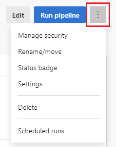

[< Previous Challenge](./01-first-pipeline.md) - **[Home](../README.md)** - [Next Challenge >](./03-jobs-pipeline.md)

## Customize your pipeline

### Prerequisite

Crete the first pipeline

### Steps

1. Understand azure-pipeline.yml file
```
trigger:
 - main

 pool:
   vmImage: 'ubuntu-latest'

 steps:
 - task: Maven@4
   inputs:
     mavenPomFile: 'pom.xml'
     mavenOptions: '-Xmx3072m'
     javaHomeOption: 'JDKVersion'
     jdkVersionOption: '1.11'
     jdkArchitectureOption: 'x64'
     publishJUnitResults: false
     testResultsFiles: '**/surefire-reports/TEST-*.xml'
     goals: 'package'
```

2. Try changing the platform to build

Currently it is in Linux agent
```
pool:
  vmImage: "ubuntu-latest"
```

Change to Windows or Mac
```
pool:
  vmImage: "windows-latest"
```

```
pool:
  vmImage: "macos-latest"
```

3. Add more scripts or tasks

```
- task: PublishCodeCoverageResults@1
  inputs:
    codeCoverageTool: "JaCoCo"
    summaryFileLocation: "$(System.DefaultWorkingDirectory)/**/site/jacoco/jacoco.xml"
    reportDirectory: "$(System.DefaultWorkingDirectory)/**/site/jacoco"
    failIfCoverageEmpty: true
```

4. Build across multiple platforms or multiple Java versions. This can be achieved using *strategy* and *matrix*.

```
strategy:
  matrix:
    linux:
      imageName: "ubuntu-latest"
    mac:
      imageName: "macOS-latest"
    windows:
      imageName: "windows-latest"
  maxParallel: 3

pool:
  vmImage: $(imageName)
```

or

```
strategy:
  matrix:
    jdk10:
      jdkVersion: "1.10"
    jdk11:
      jdkVersion: "1.11"
  maxParallel: 2
```

Note : Strategy cannot be used multiple times in a context.
maxParallel will allow parallel execution of the job defined

5. Customize CI triggers
 Pipeline triggers cause a pipeline to run. You can use trigger: to cause a pipeline to run whenever you push an update to a branch.
 
 This can be set for specific branches or pr

 ```
 trigger:
   - main
   - releases/*
 ```

```
pr:
  - main
  - releases/*
```


6. Final azure-pipeline.yml file would like below

```
trigger:
- main
- releases/*

strategy:
  matrix:
    jdk10_linux:
      imageName: "ubuntu-latest"
      jdkVersion: "1.10"
    jdk11_windows:
      imageName: "windows-latest"
      jdkVersion: "1.11"
  maxParallel: 2

pool:
  vmImage: $(imageName)

steps:
- task: Maven@4
  inputs:
    mavenPomFile: "pom.xml"
    mavenOptions: "-Xmx3072m"
    javaHomeOption: "JDKVersion"
    jdkVersionOption: $(jdkVersion)
    jdkArchitectureOption: "x64"
    publishJUnitResults: true
    testResultsFiles: "**/TEST-*.xml"
    goals: "package"
```

7. Configure Pipeline Settings. Click on More actions menu on pipeline details page
- Manage Security
- Rename/Move: your pipeline name and folder location
- Status badge : Add badge to your repo
- Delete : Delete pipeline including all builds and associated artifacts
- Scheduled runs 
- Settings: 
    - Enabled: Default setting for new run requests. Process all triggers and manual runs
    - Paused: Allow to be paused or queued without starting them
    - Disabled: Prevent new run
    - 


8. Create a work item on failure
    - Classic build pipelines are single stage, and Create work item on failure applies to the whole pipeline. YAML pipelines can be multi-stage, and a pipeline level setting may not be appropriate. To implement Create work item on failure in a YAML pipeline, you can use methods such as the Work Items - Create REST API call or the Azure DevOps CLI az boards work-item create command. For eg.,
   
    ```
    # When manually running the pipeline, you can select whether it
    # succeeds or fails.
    parameters:
    - name: succeed
      displayName: Succeed or fail
      type: boolean
      default: false
    
    trigger:
    - main
    
    pool:
      vmImage: ubuntu-latest
    
    jobs:
    - job: Work
      steps:
      - script: echo Hello, world!
        displayName: 'Run a one-line script'
    
      # This malformed command causes the job to fail
      # Only run this command if the succeed variable is set to false
      - script: git clone malformed input
        condition: eq(${{ parameters.succeed }}, false)
    
    # This job creates a work item, and only runs if the previous job failed
    - job: ErrorHandler
      dependsOn: Work
      condition: failed()
      steps: 
      - bash: |
          az boards work-item create \
            --title "Build $(build.buildNumber) failed" \
            --type bug \
            --org $(System.TeamFoundationCollectionUri) \
            --project $(System.TeamProject)
        env: 
          AZURE_DEVOPS_EXT_PAT: $(System.AccessToken)
        displayName: 'Create work item on failure'
    ``` 

