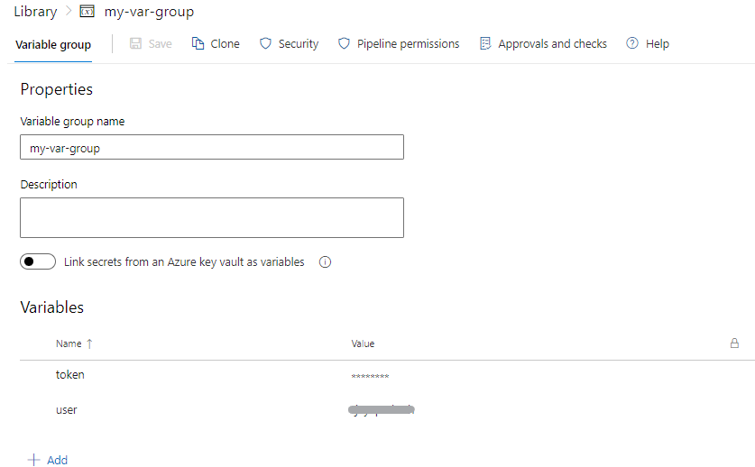

[< Previous Challenge](./05-deployment-pipeline.md) - **[Home](../README.md)** - [Next Challenge >](./07-parameter-pipeline.md)
### Library
A library is a collection of build and release assets for an Azure DevOps project. Assets defined in a library can be used in multiple build and release pipelines of the project. 

Assets are two types:
- variable groups 
- secure files

#### Variables

- User-defined : variables can be set at root, stage, job. Can also be specified outside of YAML pipeline in UI.  
    - To access across multiple pipelines use variable groups.
    - Use templates to define variables in one file and use in multiple pipeline

- System variables : predefined values.
- Environment variables: Specific to OS, For eg., On Unix $NAME, on windos %NAME% on batch and $env.NAME in powershell

Variable syntax: 
 
- Template expression variables ${{ variables.var }}) get processed at compile time
- Macro syntax variables ($(var)) get processed during runtime before a task runs
- Runtime expressions ($[variables.var]) gets processed during runtime but to be used with conditions and expressions.

### Task 1
#### Solution

```
variables:
- name: one
  value: initialValue 

steps:
  - script: |
      echo ${{ variables.one }} # outputs initialValue
      echo $(one)
    displayName: First variable pass
  - bash: echo "##vso[task.setvariable variable=one]secondValue"
    displayName: Set new variable value
  - script: |
      echo ${{ variables.one }} # outputs initialValue
      echo $(one) # outputs secondValue
    displayName: Second variable pass
```

### Task 2
#### Specify variables in pipeline
```
variables:
# a regular variable
- name: myvariable
  value: myvalue
# a variable group
- group: myvariablegroup
# a reference to a variable template
- template: myvariabletemplate.yml
```
To Access them;
- Batch script: %VARIABLE_NAME%
- PowerShell script: $env:VARIABLE_NAME
- Bash script: $VARIABLE_NAME
 
#### Secret variable
To set secrets in the web interface, follow these steps:

- Go to the Pipelines page, select the appropriate pipeline, and then select Edit.
- Locate the Variables for this pipeline.
- Add a variable *nonSecretVariable* and set a value
- Add a secret variable *mySecret* and set value
- Select the Secret lock icon to store the variable in an encrypted manner.
- Save the pipeline.
- Run the pipeline below

#### Solution
```
variables:
 GLOBAL_MYSECRET: $(mySecret) # this will not work because the secret variable needs to be mapped as env
 GLOBAL_MY_MAPPED_ENV_VAR: $(nonSecretVariable) # this works because it's not a secret.

steps:

- powershell: |
    Write-Host "Using an input-macro works: $(mySecret)"
    Write-Host "Using the env var directly does not work: $env:MYSECRET"
    Write-Host "Using a global secret var mapped in the pipeline does not work either: $env:GLOBAL_MYSECRET"
    Write-Host "Using a global non-secret var mapped in the pipeline works: $env:GLOBAL_MY_MAPPED_ENV_VAR" 
    Write-Host "Using the mapped env var for this task works and is recommended: $env:MY_MAPPED_ENV_VAR"
  env:
    MY_MAPPED_ENV_VAR: $(mySecret) # the recommended way to map to an env variable

- bash: |
    echo "Using an input-macro works: $(mySecret)"
    echo "Using the env var directly does not work: $MYSECRET"
    echo "Using a global secret var mapped in the pipeline does not work either: $GLOBAL_MYSECRET"
    echo "Using a global non-secret var mapped in the pipeline works: $GLOBAL_MY_MAPPED_ENV_VAR" 
    echo "Using the mapped env var for this task works and is recommended: $MY_MAPPED_ENV_VAR"
  env:
    MY_MAPPED_ENV_VAR: $(mySecret) # the recommended way to map to an env variable
```

### Task 3
#### Predefined variables
In YAML pipelines, you can reference predefined variables as environment variables. For example, the variable Build.ArtifactStagingDirectory becomes the variable BUILD_ARTIFACTSTAGINGDIRECTORY. Refer [Predefined-variables](https://learn.microsoft.com/en-us/azure/devops/pipelines/build/variables?view=azure-devops&tabs=yaml)


#### Reference from variable groups :

- create a PAT token. Select User settings in the top right of the page and select "Personal Access token"
  
    
- Add a new token *adotoken* and give complete access
      
    
- Copy the token generated.  add a variable `token` 
- Go to project pipeline -> Library -> Variable group
- Add a variable *token* , add the token value copied in previous step. secure the variable
- Add another variable *user* , add your username

    
- create a pipeline *variables-pipeline.yml* with below content
- Replace *devopsAccount* and *projectName* with your respective org and project name
- Save and run , the pipeline requires permission to use variable group. Click permit after initiating the run.

#### Solution

```
trigger:
- main

pool:
  vmImage: ubuntu-latest

variables: 
- group: 'my-var-group' # variable group
- name: 'devopsAccount' # new variable defined in YAML
  value: 'rjayaprakash0246'
- name: 'projectName' # new variable defined in YAML
  value: 'Pipelines'

steps:
- task: PowerShell@2
  env:
    MY_MAPPED_TOKEN: $(token) 
    # Maps the secret variable $(token) from my-var-group
  inputs:
    targetType: 'inline'
    script: |
      echo "Running the powershell script"
      Write-Host "Running the AZDO REST API to get release info"
      # Encode the Personal Access Token (PAT)
      # $env:USER is a normal variable in the variable group
      # $env:MY_MAPPED_TOKEN is a mapped secret variable
      $base64AuthInfo = [Convert]::ToBase64String([Text.Encoding]::ASCII.GetBytes(("{0}:{1}" -f $(user),$env:MY_MAPPED_TOKEN)))
      
      # Get a list of releases
      $uri = "https://dev.azure.com/$(devopsAccount)/$(projectName)/_apis/release/releases?api-version=7.1"
      Write-Host "URL:" $uri
      # Invoke the REST call
      #$result = Invoke-RestMethod -Uri $uri -Method Get -ContentType "application/json" -Headers @{Authorization=("Basic {0}" -f $base64AuthInfo)}
      
      # Output releases in JSON
      #Write-Host $result.value
- task: Bash@3
  inputs:
    targetType: 'inline'
    script: |
      # Write your commands here
      
      echo "System.DefaultWorkingDirectory" : $(System.DefaultWorkingDirectory)
      echo "Build Id " : $(Build.BuildId)
      echo "Build.SourcesDirectory" : $(Build.SourcesDirectory)
      
      echo "Agent.Name" : $(Agent.Name)
```


