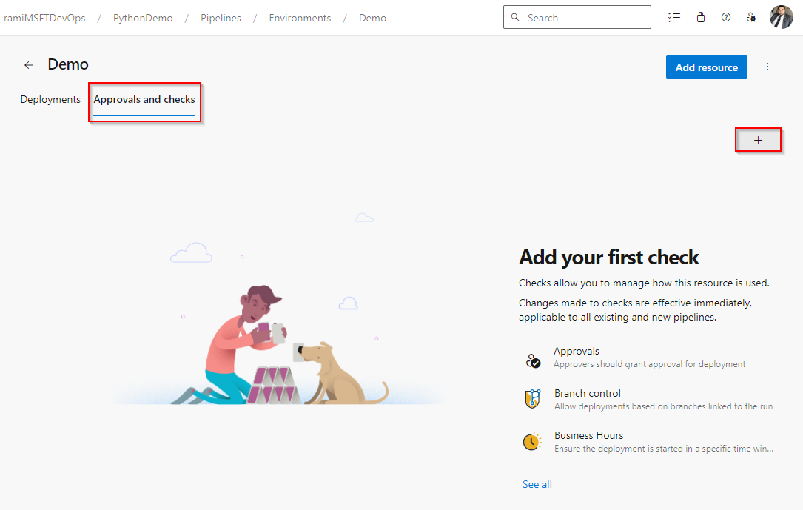
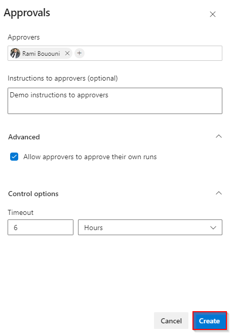
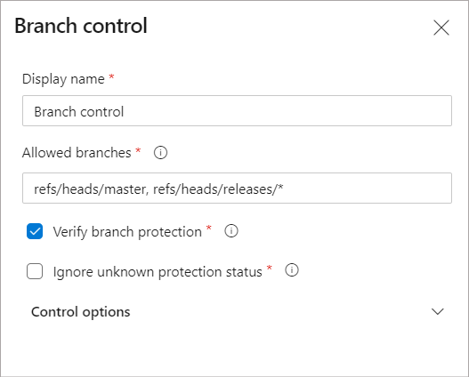

[< Previous Challenge](./08-keyvault-secret-pipeline) - **[Home](../README.md)** - [Next Challenge >](./10-templates-pipeline.md)
### Approvals and checks 

Pipelines rely on resources such as environments, service connections, agent pools, variable groups, and secure files. Checks enable the resource owner to control if and when a stage in any pipeline can consume a resource. As an owner of a resource, you can define checks that must be satisfied before a stage consuming that resource can start. For example, a manual approval check on an environment would ensure that deployment to that environment only happens after the designated user(s) has reviewed the changes being deployed.

#### Approvals
1. Sign in to your Azure DevOps organization, and then navigate to your project.
2. Select Pipelines > Environments, add an environment *Demo*
3. Select the Approvals and checks tab, and then select the + sign to add a new check.

    
    A screenshot showing how to add approvals and checks in Azure Pipelines.
4. Select Approvals, and then select Next.
5. Add users or groups as your designated Approvers, and, if desired, provide instructions for the approvers. Specify if you want to permit or restrict approvers from approving their own runs, and specify your desired Timeout. If approvals aren't completed within the specified Timeout, the stage is marked as skipped.
6. Select Create when you're done.

    
    A screenshot showing how to create a new approval.
7. Once the approval check is triggered, a prompt window, as shown in the example below, is presented in the user interface. This window provides the option for approvers to either reject or approve the run, along with any accompanying instructions.

#### Branch control
Using the branch control check, you can ensure all the resources linked with the pipeline are built from the allowed branches and that the branches have protection enabled.
To define the branch control check:

1. In your Azure DevOps project, go to the resource (for example, environment) that needs to be protected.

2. Navigate to Approvals and Checks for the resource.

3. Choose the Branch control check and provide a comma-separated list of allowed branches. You can mandate that the branch should have protection enabled. You can also define the behavior of the check in case protection status for one of the branches isn't known.

